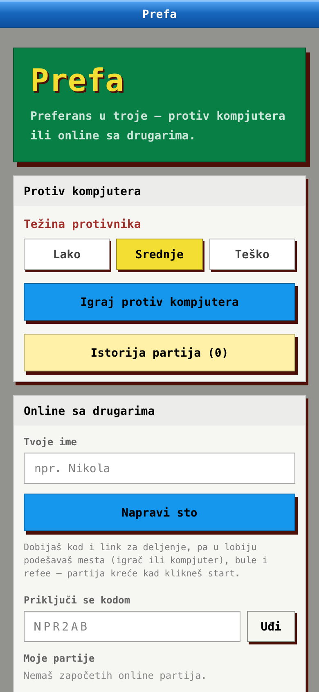
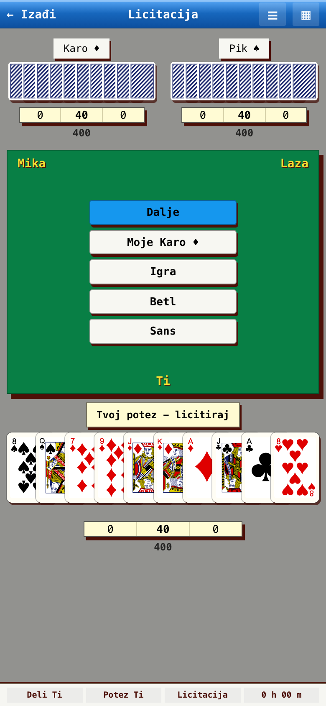
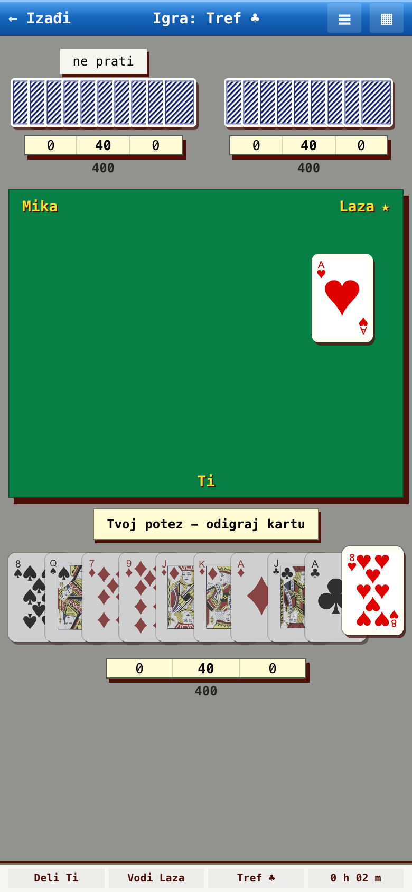

# Prefa

[](https://github.com/pajcho/preferans/actions/workflows/deploy.yml)

**Prefa** je besplatan online **preferans u troje** — real-time, mobile-first, na srpskom.
Igraš protiv kompjutera ili online sa drugarima, bez registracije i bez instalacije.

**▶ Igraj odmah: [pajcho.github.io/preferans](https://pajcho.github.io/preferans)**

| Početna | Licitacija | Igra |
| :---: | :---: | :---: |
|  |  |  |

## Mogućnosti

- 🎮 **Protiv kompjutera** — tri težine AI-ja; radi potpuno u browseru, bez servera
- 🌐 **Online sa drugarima** — napravi sto, podeli kod ili link (`/o/KOD`); bez naloga
- 🃏 **Kompletna pravila** (izvor: preferansklub.com): licitacija 2–7 sa prvenstvom („mogu“),
  „igra“ bez talona, betl i sans, pratnja i pozivanje, kontra → rekontra → subkontra → mortkontra,
  refe, supe (cap 5), bodovanje koje se brojčano poklapa sa iPref-om
- 🤖 **Botovi u online partiji** — slobodna mesta u lobiju popuniš kompjuterima (po težini); igraju na serveru
- ⚡ **Auto-završetak ruke** — kad je ishod forsiran („nosi sve“ / „nema pada“), engine to dokaže i završi
- 👀 **Posmatrači i čekaonica** — pun sto? Staneš u red i automatski sedaš kad se mesto oslobodi
- 🔄 **Reconnect** — reload ili pad mreže te vraća na tvoje mesto usred partije
- 🕵️ **Server je autoritet** — tuđe karte nikad ne stižu do tvog browsera (redakcija na serveru)
- 📜 **„Moje partije“ i istorija** — vrati se u partiju koja te čeka

Inspiracija: [iPref](http://www.ipref.com/) i [ProfiPreferans](https://www.profipreferans.com/SR/index.html) —
odlične igre, ali se plaćaju. Prefa je besplatna.

## Tehnologija

- **Frontend:** Vite · React 19 · TypeScript (strict) · Tailwind v4 · Zustand — statika na **GitHub Pages**
- **Backend:** **Cloudflare Workers + Durable Objects + D1** (free tier) — 1 partija = 1 Durable Object,
  potezi serijalizovani, view stiže push-om kroz WebSocket
- **Engine:** čist TypeScript reducer (`reduce(state, action)`), deterministički (seeded RNG),
  bez ijednog importa iz React/DOM/mreže — isti kod igra u browseru (vs-kompjuter) i na serveru (online)
- **Testovi:** Vitest (engine), vitest-pool-workers (Durable Object u workerd runtime-u), Playwright multiplayer E2E

## Pokretanje

```bash
pnpm install
pnpm dev           # http://localhost:5173
pnpm cf:dev        # online backend lokalno (wrangler dev, :8787; bez Dockera)
pnpm test          # unit testovi engine-a
pnpm test:workers  # testovi Cloudflare backend-a (GameRoom DO)
pnpm e2e           # Playwright multiplayer E2E (sam podiže oba servera)
pnpm typecheck     # tsc --noEmit (root + workers)
pnpm build         # tsc --noEmit && vite build + 404.html/.nojekyll
```

## Dokumentacija

- [docs/RULES.md](docs/RULES.md) — kompletna pravila + bodovanje (engine spec, izvor: preferansklub.com)
- [docs/ARCHITECTURE.md](docs/ARCHITECTURE.md) — arhitektura, model autoriteta, faze
- [docs/CLOUDFLARE.md](docs/CLOUDFLARE.md) — online backend (Workers + Durable Objects + D1)
- [docs/ONLINE.md](docs/ONLINE.md) — online protokol i tok partije
- [docs/ADMIN.md](docs/ADMIN.md) — interni admin dashboard (`/admin`)
- [CLAUDE.md](CLAUDE.md) — pregled za buduće sesije

## Deploy (GitHub Pages)

1. Merge PR-a u `main` (squash merge).
2. Repo → Settings → Pages → **Source: GitHub Actions**.
3. Svaki push na `main` builda, testira i deployuje (`.github/workflows/deploy.yml`).

Trenutni production path je `/preferans/` za `https://pajcho.github.io/preferans`.
Online režim u produkciji traži repo secret `VITE_API_URL` (URL deployovanog Cloudflare
Workera — vidi [docs/CLOUDFLARE.md](docs/CLOUDFLARE.md)); bez njega build radi samo
režim protiv kompjutera.

Production build pravi i `404.html`, pa normalne SPA rute rade bez hash-a na GitHub Pages:
`/preferans/`, `/preferans/vs`.

## Status

Faza 1 (engine + vs-kompjuter) i Faza 2 (online multiplayer na Cloudflare-u) su **gotove — igra je uživo**.
Sledi poliranje: zvuk, animacije, chat, replay iz loga poteza. Detaljna checklista u [CLAUDE.md](CLAUDE.md).
